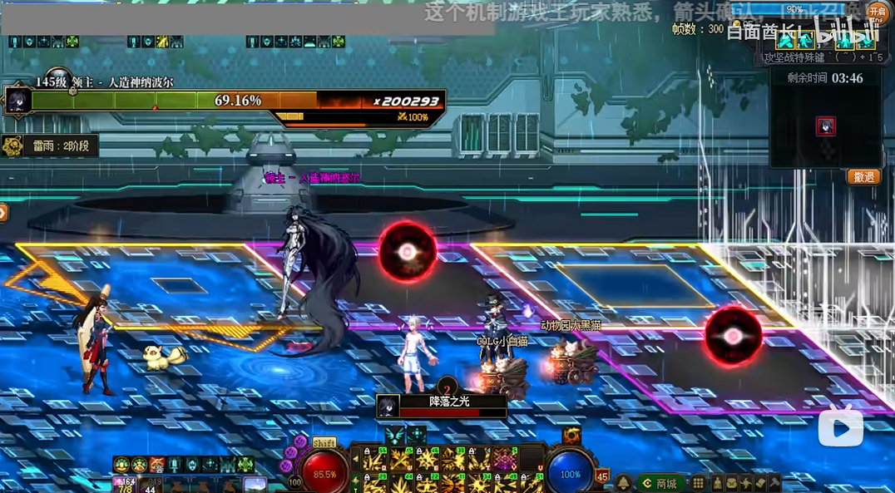
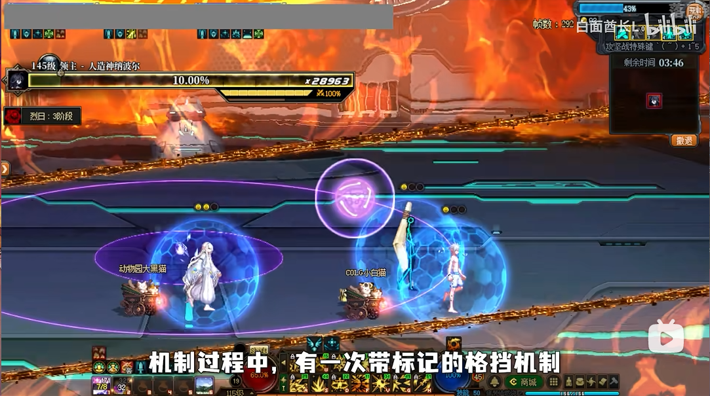
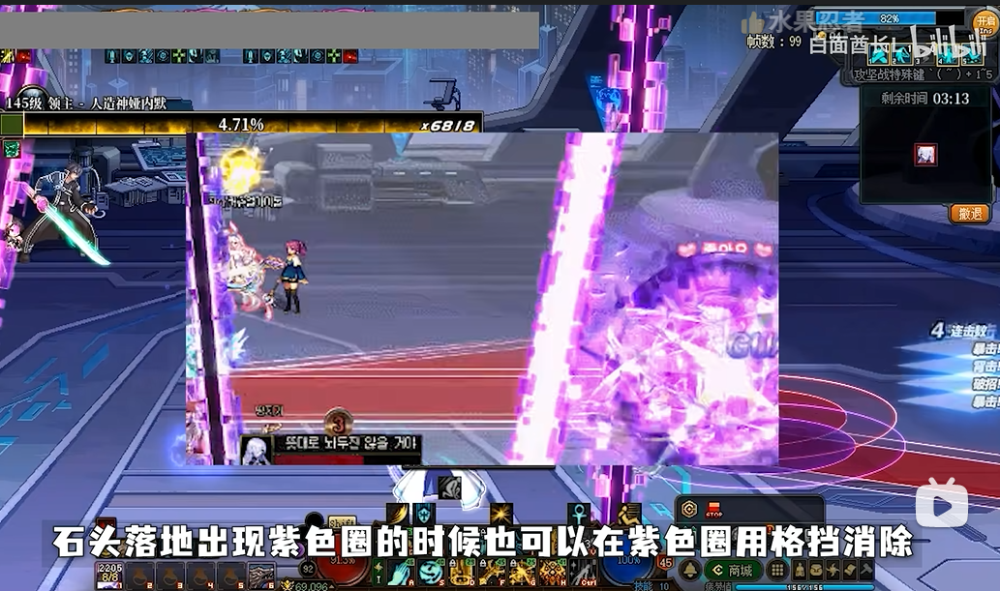

# 笔记

## 怪物：

### 0阶段：
  - #### 莫利：（减伤）赋予全场怪物30%的减伤；开场有三分钟准备时间，3分钟后赋予全场减伤；高配队伍开场可以不打莫利，红队直接本体；后续阶段，若莫利复活，需要及时清理。血量： 普通，10137亿；困难，20274亿；
  - #### 海伊徳：（减伤）锁本体的罩子，不杀的话，本体罩子的承伤只有1%。血量：普通，14481亿；困难：47064亿；
  - #### 0阶段人造神的罩子：无机制，纯木桩，直接乱杀，该格挡格挡，该躲切线躲切线。

### 1阶段：
  - #### 人造神纳波尔一阶段：（天气机制，一共有冰、雷和火三种天气，每种天气有2个大机制）；血量：普通，28963亿；困难：94128亿；
  - #### 娅内默一阶段：（锁血）不击杀的话，会锁1阶段本体10%的血量；血量：普通，14481亿；困难：47064亿。
  - #### 贝亚娜：（增伤）击杀后，全团可以获得30%的增伤，持续5分钟；血量：普通，7820亿；困难：15640亿。

### 2阶段：
  - #### 人造神纳波尔二阶段：（天气机制，依然具备各类天气机制，不同天气具备不同机制；在完成机制时需要灵活利用格挡技能；QTE机制不会按的不要上去玩，给会玩的玩就行）；血量：普通，43444亿；困难：141192亿；
  - #### 娅内默二阶段：（锁血）锁定了人造神本体2阶段的血量，击杀解除一个锁；血量：普通，21722亿；困难：70896亿。
  - #### 海伊徳二阶段：（锁血）锁定了人造神本体2阶段的血量，击杀解除一个锁；血量：普通，21722亿；困难：70896亿。

## 0阶段流程：

  - ### 红队：击杀科学家莫利消除攻坚开始3分钟后30%减伤debuff，然后进入本体破除保护罩；
  - ### 黄队：消灭研究所所长海伊徳(破罩子),解除纳波尔罩子的减伤(不击杀承伤1%)；
  - ### 绿队：先击杀潜意识怪，然后优先清理创伤怪，特别是创伤具象·手。

## 1阶段路线：打完锁血怪击杀本体进入2阶段

  - ### 红队：继续打本体，直到被提出来；出来之后看情况打增伤和锁血怪；
  - ### 黄队：击杀人造神娅内默，解除本体锁血；红队被踢之后进本体；
  - ### 绿队：优先清理创伤怪，特别是创伤具象·手

## 2阶段路线：打完两个锁血怪击杀本体结束

  - ### 红队：黄队被踢，进本体输出，被踢就打增伤/清杂；太阳好了。就使用1号BUFF一起本体
  - ### 黄队：从本体出来后，打海伊徳2阶段破锁血；红队被踢就接力本体
  - ### 绿队：莫利复活就先打莫利，然后打射箭怪；等红队指令再射箭，本体没人就压本体/span>

# 怪物机制：

## 莫利：

  - ### 机制一：欢迎洗礼（困难模式，该机制莫利脚底没有数字辅助记忆，且每次换位还会大乱位置），也就是三仙归洞，莫利召唤3个分身，真身在的位置是绿色，然后盯着他看，记住真身转移到了哪个位置，莫利脚下会有数字，辅助记忆；之后莫利会往中间移动，此时吃绿球，撞真身；同时莫利也会连线队员，如果是连的假身，那被连线的就往角落躲；如果是被真身连的，被连线的就往中间站，中间这个人捡球撞真身，这样分配不会乱；在捡球撞到一半时，莫利还会换一次位置，记住真身位置；然后接着捡球撞真身。
  
  - ### 机制二：跨越边界的步伐（困难模式，多了红框爆炸，碰到秒杀，需要躲红框走门）数字门机制，一共4列，每列有1个数字是正确的门，靠近之后按shift 入门；4人队伍的话一人试验一个门，按1~4P位置直接分；1号如果错了，1P再去5号试。门如果进对了，直接扣数字，告诉队友是几；到终点之后，捡绿球撞莫利，机制成功。 困难：

## 海伊徳：

  - ### 机制一：武器传送这个机制总结起来就是看见圈就往里站，红圈除外；站绿圈可以减少武器传送的读条，读条清空则阻止成功；如果没阻止传送，出小怪就打掉，出带黄圈的炮台就站进去玩劲舞团；

  - ### 机制二：防护盾还是看到圈就往里站，玩劲舞团，4个人一人一个角，1P左上、2P右上、3P左下和4P右下；倒计时结束前把护盾耐久弄到0就算机制成功。
    
  - ### 机制三：安全标准值（困难模式，初始数字是从-200~200开始，初始如果是负数，可以选择乘以-1的，这样就变为正数了）在读条结束前保持自己的数字大于200就行； 乘以0、除以0、除以2不要选，其他的选最大值！

## 0阶段人造神的罩子
  - 无机制，纯木桩，直接乱杀，该格挡格挡，该躲切线躲切线。

## 人造神【1阶段】

  - ### 冰：天气机制 冰属性时，角色身上会有寒冰能量球；如果受到伤害则增加寒冰能量，能量满了会变僵尸，此时需要队友撞3下来解除；角色死亡也会重置能量球。

    - #### 雷：天气机制 雷属性时，角色身上会有雷电能量球；如果受到伤害则增加雷电能量，能量满了会变僵尸，此时需要队友撞3下来解除；角色死亡也会重置能量球。 冰机制1：冰霜风暴 地图中出现红球，分一个人去捡；如果球没人捡，数字会减少，数字清零机制失败；捡起来后会出现旋风攻击，四处绕着跑；如果被攻击到，球会掉地上，同一个人无法连续捡球的；这个时候就需要其他人接力捡球；只要保证读条结束前，数字不被清为零就算机制成功；
  
    - #### 冰机制2：酷寒之回廊  （困难模式有篮圈点名，要篮圈位置固定之后，再到柱子旁边躲大风） 开始机制后，角色会不断往冰面上飞；需要控制角色远离冰面，此外地图中会出现柱子，如果被红圈点名了，记得远离柱子；红圈爆炸之后，地面出现红球，拾取之后会减少读条的数字，数字清零则机制成功；中途出现台词【越是抵抗，便越是艰难】时，周围会出现冰刺；随后会挂起大风，此时需要站到柱子旁边以免被风刮走秒杀； 困难：
  
  - ### 火：天气机制 火属性时，角色身上会有火焰能量球；如果受到伤害则增加火焰能量，能量满了会变僵尸，此时需要队友撞3下来解除；角色死亡也会重置能量球。雷：天气机制 雷属性时，地图会分割成积水区和无水区，BOSS会释放落雷攻击；如果被点名，脚底下会有雷电图标，此时引到无水区即可；
    
    - #### 雷机制1：电流暴雨地图中出现两个大水球，按Z进入，进入后收集地图中的小水球；单人拾取到8个小水球后，会攻击BOSS一次，累计拾取32个小水球机制就成功了；大水球有三次攻击上限，如果被攻击到3次以上会从水球里弹出来，需要重新进；中途出现点名的话，需要走到无水区放电；
     
    - #### 雷机制1：降落之光地图中出现黄色雷区，并带有方向键，记住方向的位置；随后BOSS点名一个队员释放落雷攻击，画面中也会有红色读条，读条结束前跳跃躲避震击伤害；落雷后地面会出现紫球，拾取后放置到之前雷区箭头所指的地板上；所有箭头位置都放置好紫球后，紫球会合成为黄色雷球，在中间读条结束前，合成两个雷球就算机制成功，合成三个，则增加BOSS所受伤害；

  - ### 火：天气机制 火属性时，地图中会出现燃烧地带，被火焰灼烧会受到大量伤害，灼烧地带的覆盖区域，会随机制的演变而变化。
    
    - #### 火机制1：火焰结晶 地图中生成火焰结晶，并出现篮球；此时需要拾取篮球，并撞击结晶将其推向一侧尽头，则算机制成功；
  
    - #### 火机制2：防护盾 机制开始后，玩家会获得一个蓝色保护罩，普通模式可以承伤3次，困难则是2次；在机制结束后，依旧维持保护罩的存在就算机制成功；机制过程中，有一次带标记的格挡机制，格挡成功可以恢复一次罩子次数，如果罩子碎了会给你补1个1次的；机制结束时，没有罩子的直接被秒，有罩子的，根据个人罩子承伤次数分别赋予25/50/100%的增伤。

## 娅内默【1阶段】

  - ### 机制1：分解 地图中出现绿圈，普通模式2个，困难3个；读条结束前需要每个圈里都站人，之后站圈的人会被落石攻击，落石位置有红圈提示；需要把落石引到紫色切线的位置进行消除，普通要切4个，困难要5个；石头落地出现紫圈的时候也可以在紫圈用格挡消除；
   
  - ### 机制2：铺路 （困难模式会有消除不了的黑色地板，并伴随切线攻击）简单来讲就是把左右两边的金色地板链接起来；BOSS会挑人点名，如果是红色圈，就站紫色上，这样可以把紫色地板变成普通地板；如果是金色圈，就站普通地板上，普通地板就变成金色了；在倒计时结束前把路连上，倒计时结束后，所有人会瞬移到左边的金色地板；然后踩着铺好的路跑到右边拿护盾，抵挡随后的秒杀伤害；困难：
  
  - ### 机制3：你怎么看起来马上要 地图中出现3个紫色石头，并生成绿色光圈；此时需要踩到绿圈上，随后角色身上会出现紫色锁链，锁链链接着一块石头，引到红圈攻击自己链接的那块石头即可；石头被攻击后有二次震荡波，需要起跳躲避；
  
  - ### 机制3：还是放弃挣扎吧 BOSS锁定一个队员，地图中会出现绿色圈圈，其他三个人站绿圈，然后一人站一个紫色区域格挡飞过来的石头

## 贝亚娜
  
  - ### 机制1：能量增强飞轮  机制开始后，发射飞轮攻击玩家，站紫色射线上，进行格挡，减少飞轮数量；在地面出现跳跃标识后，等红圈扩散至最大起跳躲避全屏伤害；读飞轮收回指令时，需要攻击地面带有血条的飞轮，读条结束前清空数字，避免机制秒杀；
  
  - ### 机制2：火焰飞轮 （困难模式，会生成持续移动的飞轮，需要及时躲开）地图出现多组飞轮攻击，绿色的区域是安全区；跟着绿色区域移动即可，有红色区域就躲开；出现紫色标识时，格挡成功BOSS会破防5秒，拾取掉落的绿色小球，在机制结束后可以获得5%增伤，每人最多吃2个球；机制快结束时生成爆炸球，会强制所有人倒地，此时全员蹲伏，躲避秒杀；困难：

## 娅内默【2阶段】

  - ### 机制1：希望毫无意义  机制发动后，玩家会各自传送到一个独立房间；地图中会生成一个逆时针旋转的金色石块，底部带绿圈显示；BOSS会点名玩家发动区域攻击；需要判断石块的轨迹，引导红色区域攻击到石块；攻击到1次，点数会增加1点，满了（4次）就算成功；成功判定之后，BOSS的红色攻击区域会变小，越后越难；自己完成机制后，可以出去帮队友一起完成；读条结束时，没有完成机制的会被秒杀

  - ### 机制2：没有真正意义上的家人  开始机制后，角色脚下会有金色探测仪；跟着指向的方向，引导BOSS攻击对应的地板；完成机制，地板会变成紫色；带黑色的污染地板不要碰，会掉血；出现台词：【你怎么还是如此执迷不悟】时，找到金色地板位置，站里面躲避后续爆炸；完成三次探测后，机制成功

  - ### 机制3：不要碰我的目标  地图中会出现带绿圈的金色小正方体和大型正方体；拾取小正方体或者进入大正方体都可以躲避全屏爆炸；但是不能两个都弄，不然队友就会遭殃。

  - ### 机制4：切屏  一种引导类型的切屏，发动后需要快速找到带绿圈的正方体固定切屏位置；可以根据角色身上的锁链来进行定位，其他的就是常规切屏了；款式很多，可以参考拉尔戈的切屏机制，在恰当时候进入安全区；

## 海伊徳【2阶段】

  - ### 机制1：搭建安保系统  类似巴卡尔拔剑，奶站中间的篮圈，保证自己不死就行，死了的话机制直接炸；其他人会被传送到周围的小房间，传到周围小房间的需要破坏所有房间的炮塔； 普通模式有4个，分布在角落4个房间，困难8个，全图破坏之后相邻的两个房间会发生秒杀爆炸；推荐所有人集中在一起后，开始一个个破坏；

  - ### 机制2：噩梦具象化  开始机制后，玩家被传送到小黑屋内；正面朝向区域可以打灯，BOSS会在黑暗中（灰雾的位置）逐步接近；被灯光找到，BOSS就会变木头人； 随后角色身上出现篮圈，需要引导篮圈攻击房间的科学家； 数字清零，则机制成功。

  - ### 机制3：目标指定【困难独有】  机制开始后，点名一个队员连续攻击；被点名的需要成功格挡紫色攻击（带图标的）3次；其他人把激光引开，不要干扰到被点名的队员； 成功格挡完3次，则机制成功。

## 人造神纳波尔【2阶段】
 
  - ### 机制1：内心世界  如果BOSS的白色圈攻击没有格挡到，那么就会进入这个机制；到了内心世界后，每次格挡成功会减少头顶的读条时间；清空之后就可以脱离内心世界。

  - ### 机制2：内心的绝望  BOSS的承伤强制变为0%，进入1分30秒的绝望时间；每格挡成功1次，BOSS的承伤+2%；绝望时间结束后，根据之前格挡成功次数计算当前的承伤率。

  - ### 机制3：注定的毁灭  地图中生成白色小球，需要站到紫圈内进行格挡，没被挡道的球会被BOSS吸收转化为护盾； 随后地图中间生成紫圈，在紫圈快到最大时格挡；随后进入QTE环节，这个会玩的上去玩，不会玩的就别进紫圈挡了，直接在红圈挡；QTE的玩家格挡成功后，在绿色区域按下 x，然后疯狂按空格【个人体验：手速慢的话还得两个手去一起按】；这个时候，雾神出来帮你，就表示机制成功了，成功后该玩家会获得20%的增伤，持续30秒；这之后会读毁灭条，毁灭条满了如果护盾还没有打掉就会全灭。

  - ### 冰：天气机制 
    
    - #### 冰机制1：冰冷的安息  地图中出现3个篮球，1个红球；需要玩家拾取红球后，再沿路捡完篮球；但是拾取红球后，移速会变得很低，还伴随大量攻击； 且头顶还有一个倒计时读条，读条结束就会被冻住，球会掉下来；其他人需要帮助捡球的人进行格挡；球掉落了就需要其他人来接力捡球了，非常考验配合；

    - #### 冰机制2：冰冷的终结  地图中出现大篮圈和篮球，先躲篮圈，不然吃到就变僵尸；躲完就把4个篮球 推到冰刺上消除掉；小篮球2个人各捡一个，捡完贴贴就可以消除掉；在地面出现紫圈的时候，及时格挡，如果没挡道，BOSS迟到生成的紫球会发动全屏攻击；上述机制完成越多，BOSS承伤越高。

  - ### 火：天气机制 
  
    - #### 火机制1：灾害  地图中出现带血条的红球，同时点名玩家发动红圈攻击； 被点名的引红圈攻击红球，直到血条清空为止；其他人减小篮球，撞两边的火墙，扩大安全区；机制一共持续三轮，读条清空后结束。
    
    - #### 火机制2：寂静的安息  地图中出现巨型石柱，石柱有血条；随后会点名2个人发动火焰攻击（身上会有标记）；被点名的玩家各找1根柱子钻进去，躲避接下来的火焰攻击； 攻击结束后会出现石块，捡起石块撞石柱，会给石柱回复血量； 如果被点名的人是大红圈，那么就把红圈往下引，远离石柱； 随后会伴随陨石攻击，被陨石点到的找根血量最少的柱子往里钻；在寂静的安息读条结束后存活，则机制成功。
    
    - #### 火机制3：锁定火墙  机制开始会锁定一人，在他的左右两侧生成火墙；其他人跟着他一起躲切线就好。
    
  - ### 雷：天气机制【困难独有】 

    - #### 雷机制1：无可避免的归宿  地面会变成湖面，能看到角色的倒影，需要找到看不到倒影的位置； 迟到黄球后，引导红圈攻击该位置；成功后，BOSS出现，并赋予玩家黄圈；其中两个人的全会有黄色射线；引导射线攻击BOSS，成功4次机制成功；但需要注意，带射线的圈不能和其他圈重叠，否则会直接失效；通用解法：没线战两边，有线站中间，射线打BOSS，同时注意：中间的两个人不要将圈重叠。
    
    - #### 雷机制2：毫厘间的失误  地面出现蓝色小球，拾取后可以获得护盾； 获得护盾后，不能被攻击到，否则护盾会消失；护盾持续一段时间后，会变成针刺攻击BOSS，可以增加承伤；读条结束后，BOSS破防，最终承伤看针刺攻击的多少。