### 笔记

## 怪物：

- 0阶段：
  - 莫利：（减伤）赋予全场怪物30%的减伤；开场有三分钟准备时间，3分钟后赋予全场减伤；高配队伍开场可以不打莫利，红队直接本体；后续阶段，若莫利复活，需要及时清理。血量： 普通，10137亿；困难，20274亿；
  - 海伊徳：（减伤）锁本体的罩子，不杀的话，本体罩子的承伤只有1%。血量：普通，14481亿；困难：47064亿；
  - 0阶段人造神的罩子：无机制，纯木桩，直接乱杀，该格挡格挡，该躲切线躲切线。
- 1阶段：
  - 人造神一阶段：（天气机制，一共有冰、雷和火三种天气，每种天气有2个大机制）；血量：普通，28963亿；困难：94128亿；
  - 娅内默一阶段：（锁血）不击杀的话，会锁1阶段本体10%的血量；血量：普通，14481亿；困难：47064亿。
  - 贝亚娜：（增伤）击杀后，全团可以获得30%的增伤，持续5分钟；血量：普通，7820亿；困难：15640亿。

## 0阶段流程：

- 红队：击杀科学家莫利消除攻坚开始3分钟后30%减伤debuff，然后进入本体破除保护罩；
- 黄队：消灭研究所所长海伊徳(破罩子),解除纳波尔罩子的减伤(不击杀承伤1%)；
- 绿队：先击杀潜意识怪，然后优先清理创伤怪，特别是创伤具象·手。

## 1阶段路线：打完锁血怪击杀本体进入2阶段

- 红队：继续打本体，直到被提出来；出来之后看情况打增伤和锁血怪；
- 黄队：击杀人造神娅内默，解除本体锁血；红队被踢之后进本体；
- 绿队：优先清理创伤怪，特别是创伤具象·手

## 怪物机制：

- 莫利：
  - 机制一：欢迎洗礼（困难模式，该机制莫利脚底没有数字辅助记忆，且每次换位还会大乱位置），也就是三仙归洞，莫利召唤3个分身，真身在的位置是绿色，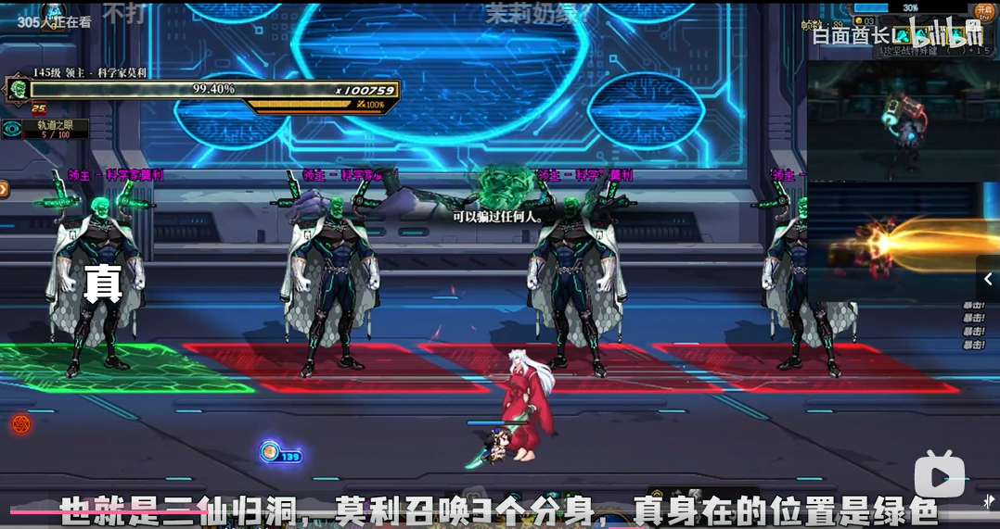然后盯着他看，记住真身转移到了哪个位置，莫利脚下会有数字，辅助记忆；之后莫利会往中间移动，此时吃绿球，撞真身；同时莫利也会连线队员，如果是连的假身，那被连线的就往角落躲；如果是被真身连的，被连线的就往中间站，中间这个人捡球撞真身，这样分配不会乱；在捡球撞到一半时，莫利还会换一次位置，记住真身位置；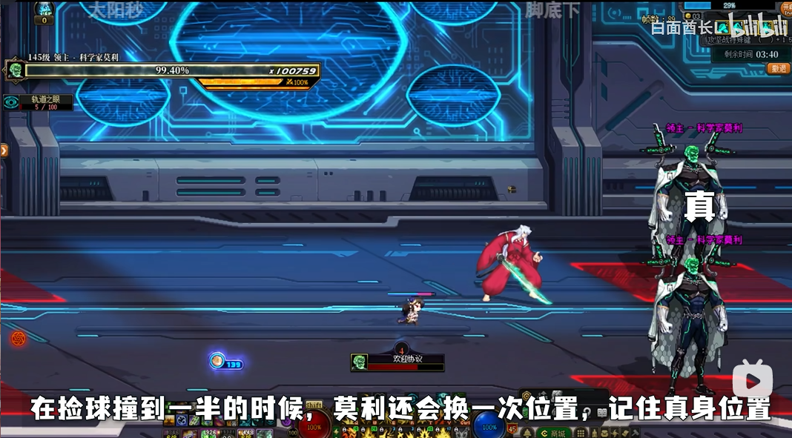然后接着捡球撞真身。
  - 机制二：跨越边界的步伐（困难模式，多了红框爆炸，碰到秒杀，需要躲红框走门）数字门机制，一共4列，每列有1个数字是正确的门，靠近之后按shift 入门；4人队伍的话一人试验一个门，按1~4P位置直接分；1号如果错了，1P再去5号试。门如果进对了，直接扣数字，告诉队友是几；到终点之后，捡绿球撞莫利，机制成功。 困难：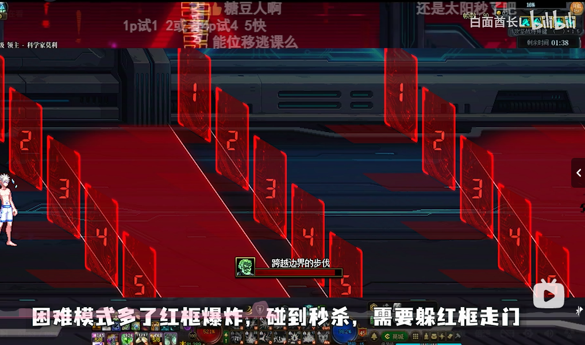

- 海伊徳：
  - 机制一：武器传送这个机制总结起来就是看见圈就往里站，红圈除外；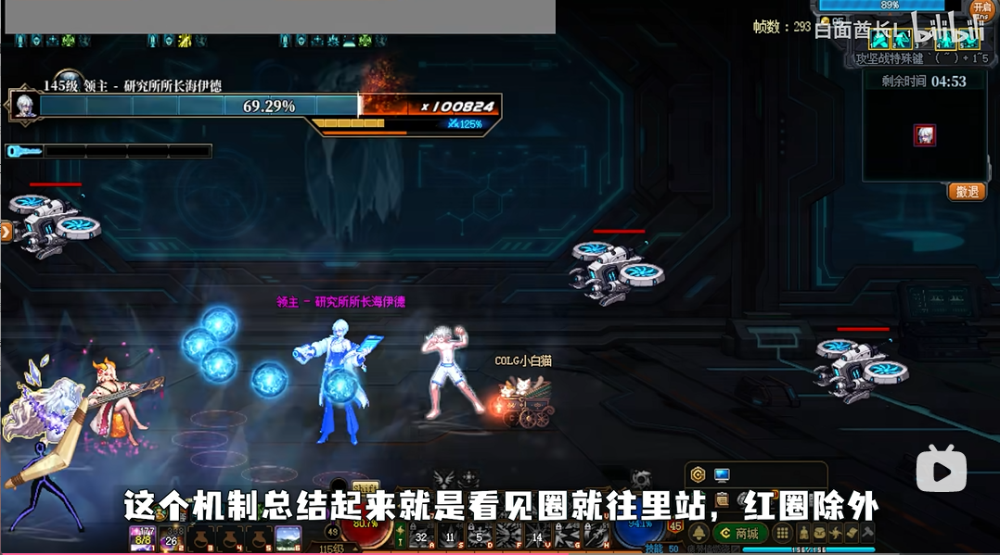站绿圈可以减少武器传送的读条，读条清空则阻止成功；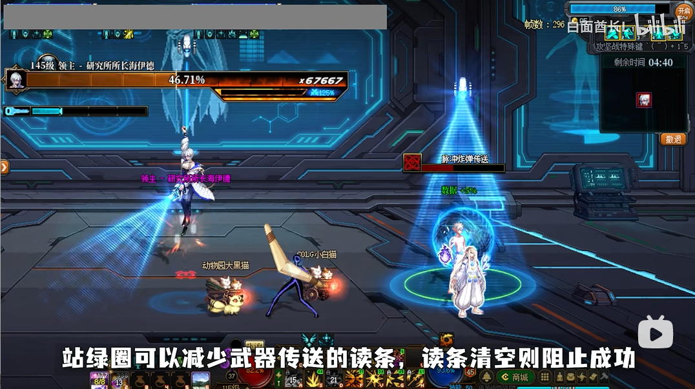如果没阻止传送，出小怪就打掉，出带黄圈的炮台就站进去玩劲舞团；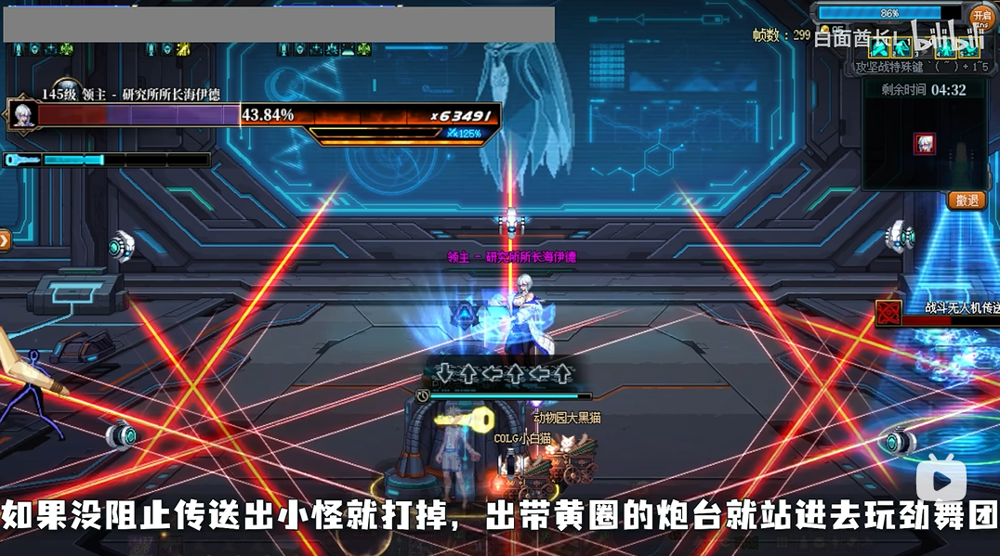
  - 机制二：防护盾还是看到圈就往里站，玩劲舞团，4个人一人一个角，1P左上、2P右上、3P左下和4P右下；倒计时结束前把护盾耐久弄到0就算机制成功。
    - 机制三：安全标准值（困难模式，初始数字是从-200~200开始，初始如果是负数，可以选择乘以-1的，这样就变为正数了）在读条结束前保持自己的数字大于200就行； 乘以0、除以0、除以2不要选，其他的选最大值！

- 0阶段人造神的罩子
  - 无机制，纯木桩，直接乱杀，该格挡格挡，该躲切线躲切线。

- 人造神【1阶段】
  - 冰：天气机制 冰属性时，角色身上会有寒冰能量球；如果受到伤害则增加寒冰能量，能量满了会变僵尸，此时需要队友撞3下来解除；角色死亡也会重置能量球。
    - 冰机制1：冰霜风暴 地图中出现红球，分一个人去捡；如果球没人捡，数字会减少，数字清零机制失败；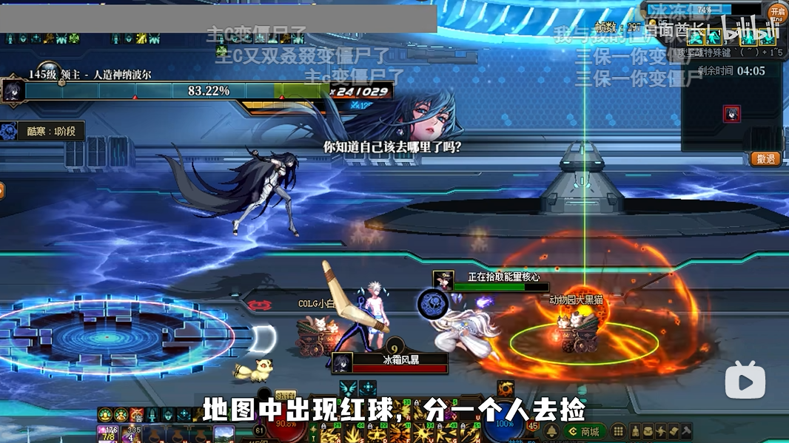捡起来后会出现旋风攻击，四处绕着跑；如果被攻击到，球会掉地上，同一个人无法连续捡球的；这个时候就需要其他人接力捡球；只要保证读条结束前，数字不被清为零就算机制成功；
    - 冰机制2：酷寒之回廊  （困难模式有篮圈点名，要篮圈位置固定之后，再到柱子旁边躲大风） 开始机制后，角色会不断往冰面上飞；需要控制角色远离冰面，此外地图中会出现柱子，如果被红圈点名了，记得远离柱子；红圈爆炸之后，地面出现红球，拾取之后会减少读条的数字，数字清零则机制成功；中途出现台词【越是抵抗，便越是艰难】时，周围会出现冰刺；随后会挂起大风，此时需要站到柱子旁边以免被风刮走秒杀；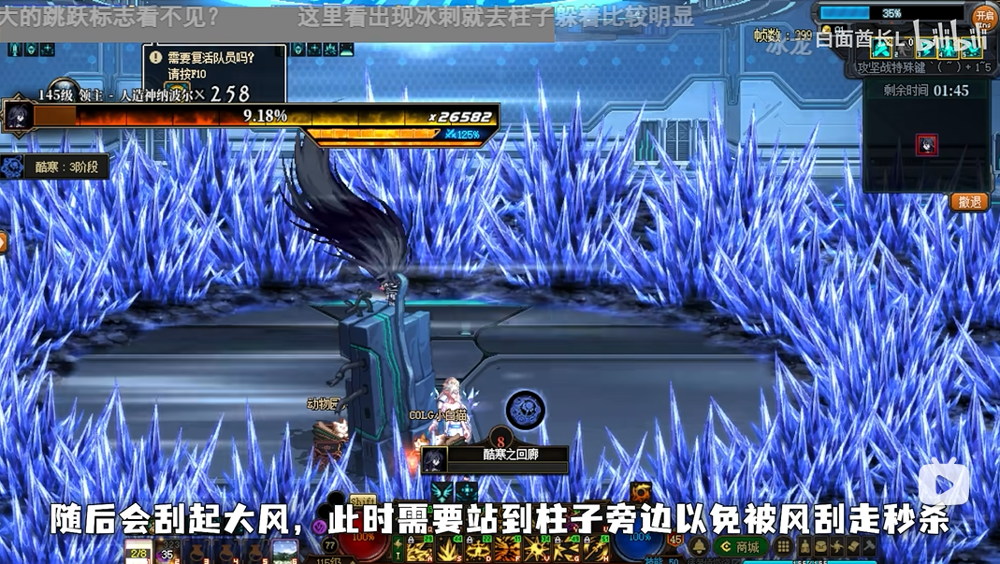 困难：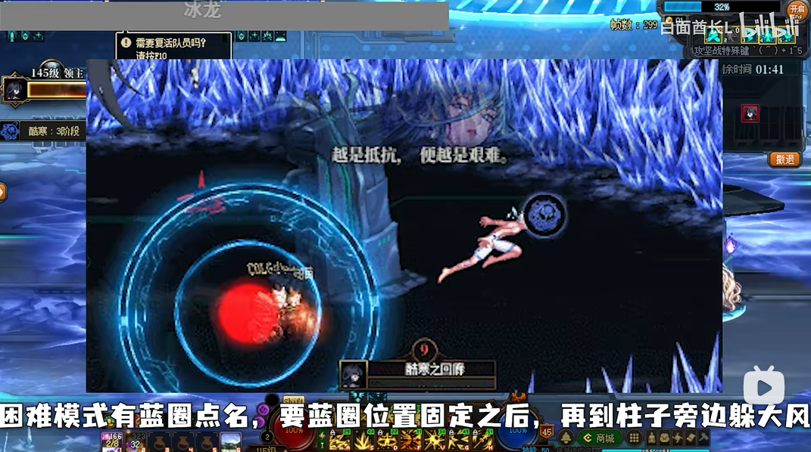
  
  - 雷：天气机制 雷属性时，地图会分割成积水区和无水区，BOSS会释放落雷攻击；如果被点名，脚底下会有雷电图标，此时引到无水区即可；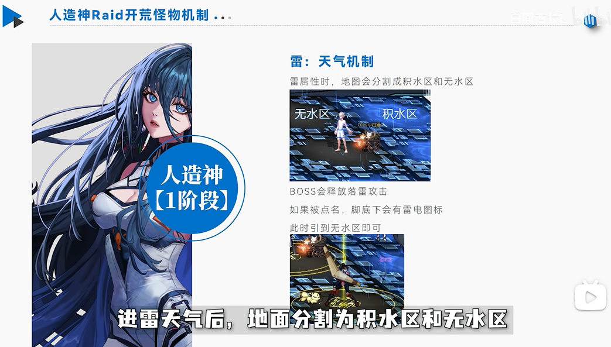
    - 雷机制1：电流暴雨地图中出现两个大水球，按Z进入，进入后收集地图中的小水球；单人拾取到8个小水球后，会攻击BOSS一次，累计拾取32个小水球机制就成功了；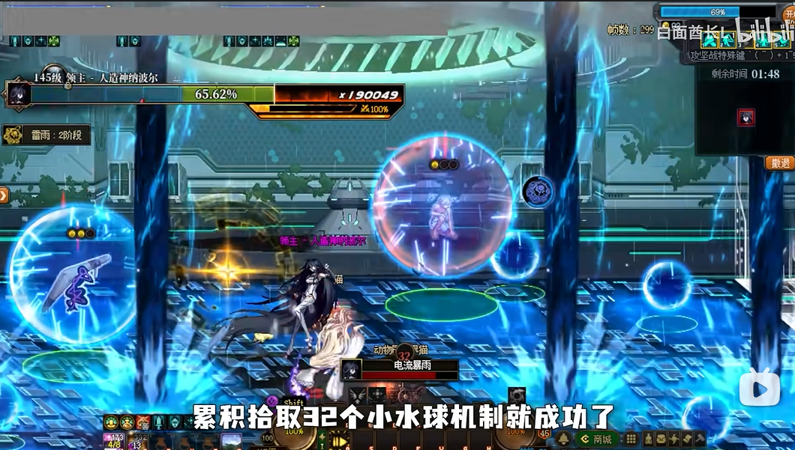大水球有三次攻击上限，如果被攻击到3次以上会从水球里弹出来，需要重新进；中途出现点名的话，需要走到无水区放电；
    - 雷机制1：降落之光地图中出现黄色雷区，并带有方向键，记住方向的位置；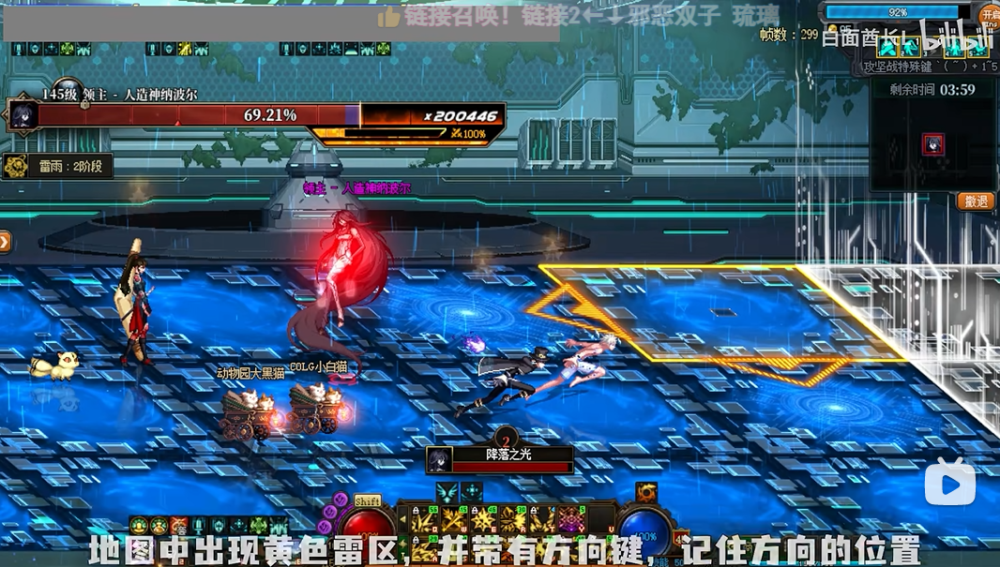随后BOSS点名一个队员释放落雷攻击，画面中也会有红色读条，读条结束前跳跃躲避震击伤害；落雷后地面会出现紫球，拾取后放置到之前雷区箭头所指的地板上；所有箭头位置都放置好紫球后，紫球会合成为黄色雷球，在中间读条结束前，合成两个雷球就算机制成功，合成三个，则增加BOSS所受伤害；

  - 火：天气机制 火属性时，地图中会出现燃烧地带，被火焰灼烧会受到大量伤害，灼烧地带的覆盖区域，会随机制的演变而变化。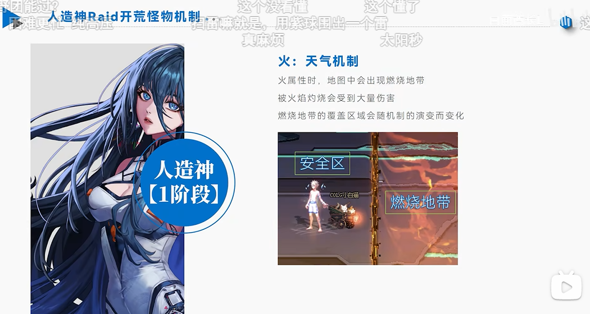
    - 火机制1：火焰结晶 地图中生成火焰结晶，并出现篮球；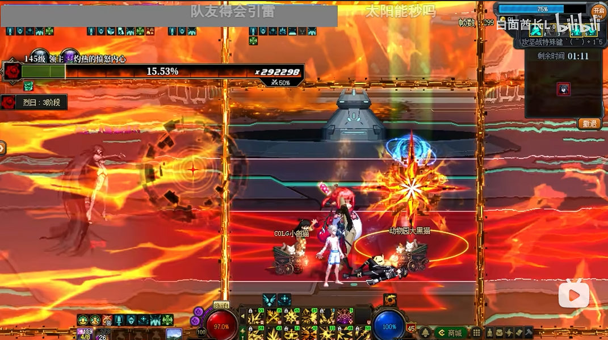此时需要拾取篮球，并撞击结晶将其推向一侧尽头，则算机制成功；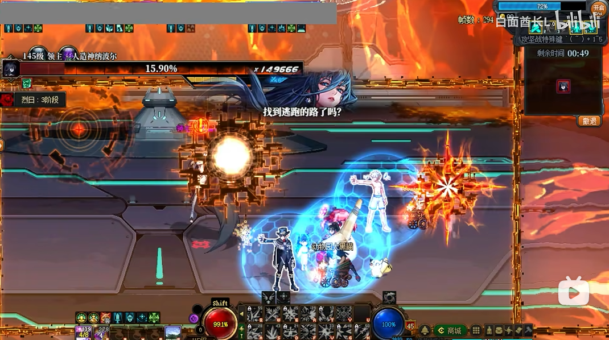
    - 火机制2：防护盾 机制开始后，玩家会获得一个蓝色保护罩，普通模式可以承伤3次，困难则是2次；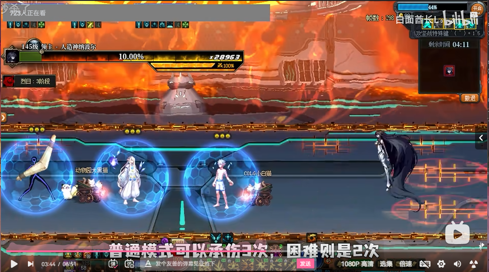在机制结束后，依旧维持保护罩的存在就算机制成功；机制过程中，有一次带标记的格挡机制，格挡成功可以恢复一次罩子次数，如果罩子碎了会给你补1个1次的；机制结束时，没有罩子的直接被秒，有罩子的，根据个人罩子承伤次数分别赋予25/50/100%的增伤。

- 娅内默【1阶段】
  - 机制1：分解 地图中出现绿圈，普通模式2个，困难3个；读条结束前需要每个圈里都站人，之后站圈的人会被落石攻击，落石位置有红圈提示；需要把落石引到紫色切线的位置进行消除，普通要切4个，困难要5个；石头落地出现紫圈的时候也可以在紫圈用格挡消除；
  - 机制2：铺路 （困难模式会有消除不了的黑色地板，并伴随切线攻击）简单来讲就是把左右两边的金色地板链接起来；BOSS会挑人点名，如果是红色圈，就站紫色上，这样可以把紫色地板变成普通地板；如果是金色圈，就站普通地板上，普通地板就变成金色了；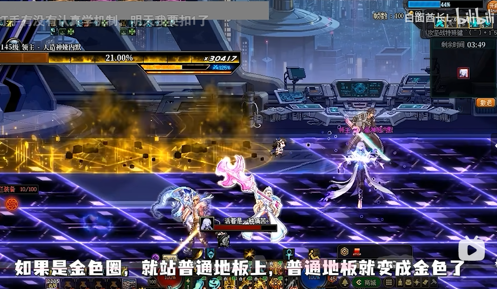在倒计时结束前把路连上，倒计时结束后，所有人会瞬移到左边的金色地板；然后踩着铺好的路跑到右边拿护盾，抵挡随后的秒杀伤害；困难：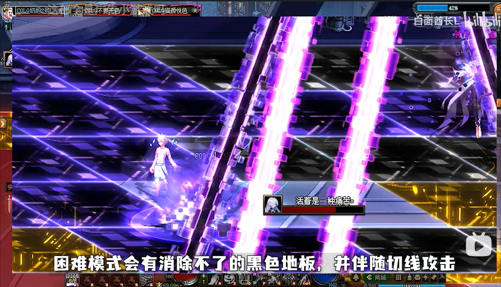
  - 机制3：你怎么看起来马上要 地图中出现3个紫色石头，并生成绿色光圈；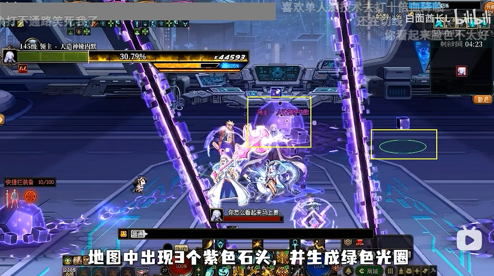此时需要踩到绿圈上，随后角色身上会出现紫色锁链，锁链链接着一块石头，引到红圈攻击自己链接的那块石头即可；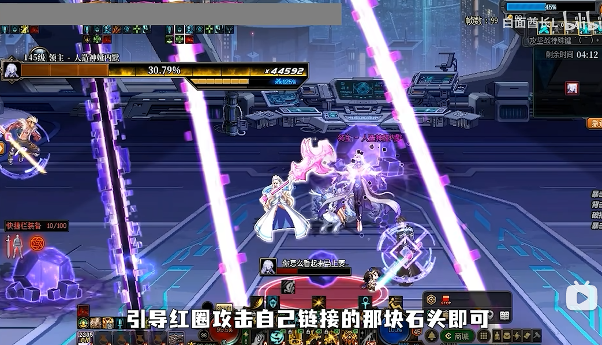石头被攻击后有二次震荡波，需要起跳躲避；
  - 机制3：还是放弃挣扎吧 BOSS锁定一个队员，地图中会出现绿色圈圈，其他三个人站绿圈，然后一人站一个紫色区域格挡飞过来的石头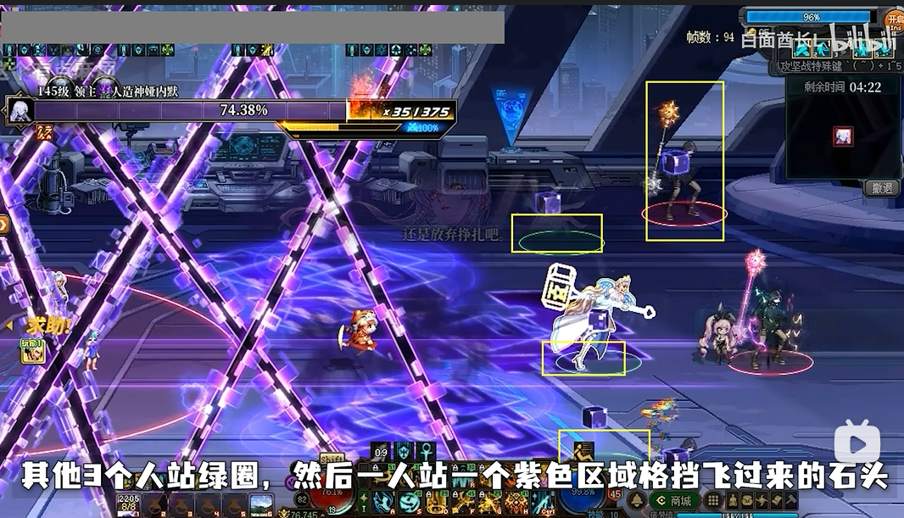

- 贝亚娜
  - 机制1：能量增强飞轮  机制开始后，发射飞轮攻击玩家，站紫色射线上，进行格挡，减少飞轮数量；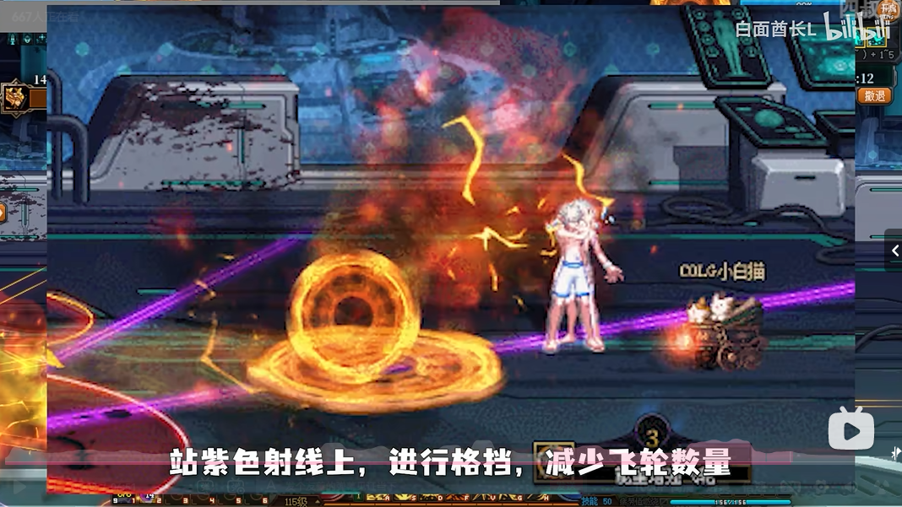在地面出现跳跃标识后，等红圈扩散至最大起跳躲避全屏伤害；读飞轮收回指令时，需要攻击地面带有血条的飞轮，读条结束前清空数字，避免机制秒杀；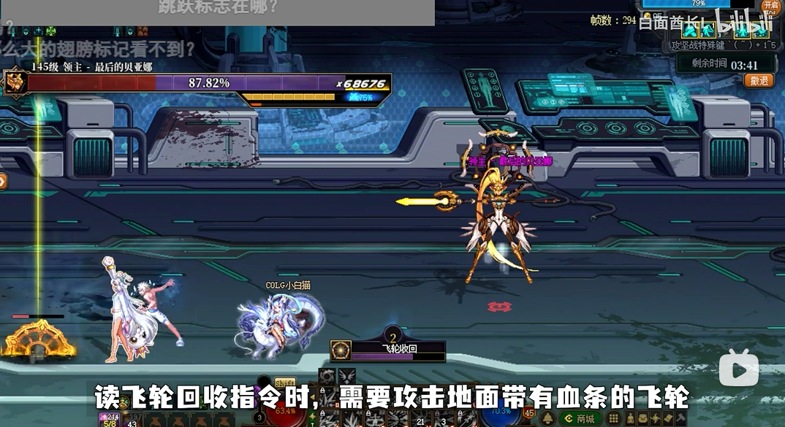
  - 机制2：火焰飞轮 （困难模式，会生成持续移动的飞轮，需要及时躲开）地图出现多组飞轮攻击，绿色的区域是安全区；跟着绿色区域移动即可，有红色区域就躲开；出现紫色标识时，格挡成功BOSS会破防5秒，拾取掉落的绿色小球，在机制结束后可以获得5%增伤，每人最多吃2个球；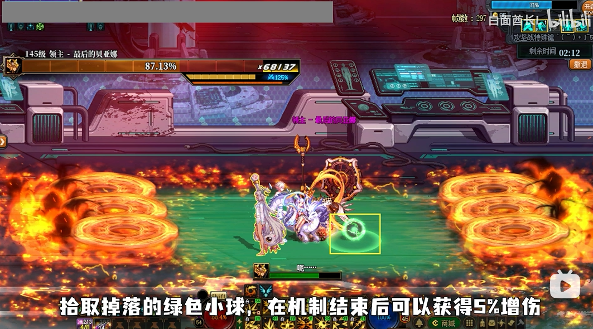机制快结束时生成爆炸球，会强制所有人倒地，此时全员蹲伏，躲避秒杀；困难：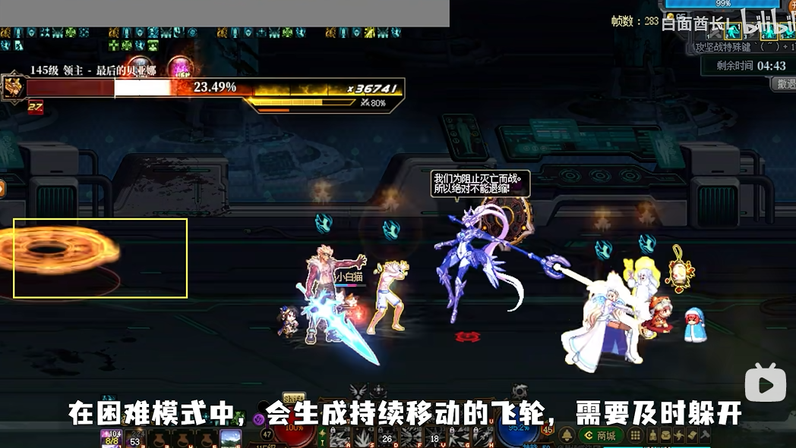